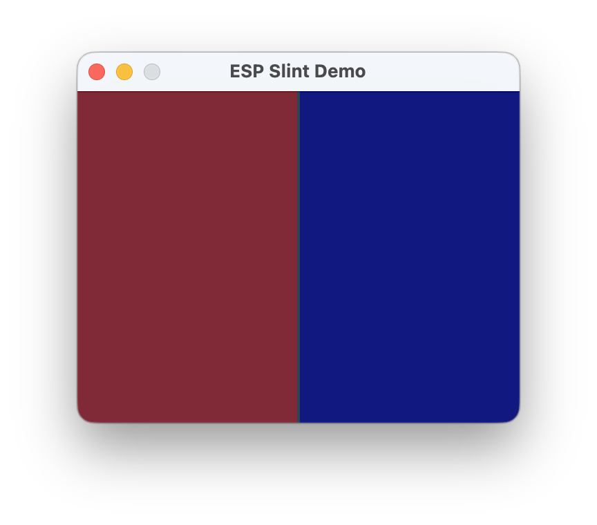
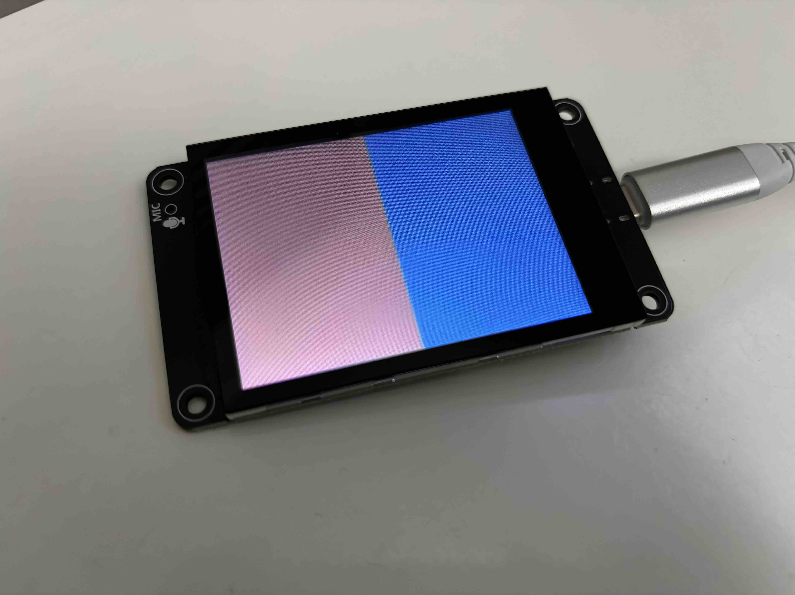

# About
This repository provides a demo for running in Slint on the
[Hoysond ESP32-S3 + 2.8" ILI9341 TFT + CST816 capacitive touch board](https://www.amazon.com/dp/B0FKG7WRWV?ref=fed_asin_title).

# Preview on Desktop
Run `cargo preview` and you'll see something like the following:


# Running on ESP32 Board
After sourcing your esp toolchain with
`source "$HOME/export-esp.sh"`(see next section), run `cargo flash-esp`
and you'll see something like the following:


# Dependencies
### 1) Install esp-rs toolchain + utilities
This project expects the `esp` Rust toolchain and Xtensa target support.
A common setup flow is:

```bash
# install espup (once)
cargo install espup
espup install

```
Then do`source "$HOME/export-esp.sh"` every time you open a new terminal.
